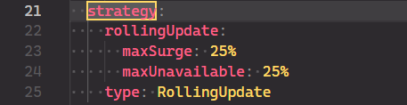

# Reflection 1
1.  Compare the application logs before and after you exposed it as a Service. Try to open the app several times while the proxy into the Service is running. What do you see in the logs? Does the number of logs increase each time you open the app?
Before the app is exposed as a service, the log only contains the message that states that a HTTP server is started and is listening to port :8080 and an UDP server is started and listening to port :8081. Exposing the app as a service allows us to interact and communicate with the server from outside the kubernetes cluster. After exposing the app, and opening it, it has caused the logs to grow in size, that is because there's a logging funciton within the server that prints out every incoming HTTP request along with a timestamp. Everytime the app is opened, the log increases, this is because opening the app sends a HTTP request to the app's server which triggers the log to write more message. 

2. Notice that there are two versions of `kubectl get` invocation during this tutorial section. The first does not have any option, while the latter has `-n` option with value set to `kube-system`. What is the purpose of the `-n` option and why did the output not list the pods/services that you
explicitly created?
the `-n` flag stands for namespaces, the command `kubectl get pods,services -n kube-system` is used to get all pods and services that have the 'kube-system' namespace. Our previous services and pods is under a different namespace ('default'). This is why the services/pods that I have previously explicitly created did not appear on the output.

# Reflection 2
1. What is the difference between Rolling Update and Recreate deployment strategy?
Rolling Update is a deployment strategy that updates the pods in a rolling fashion, meaning that it updates the pods one by one, while the old pods are still running. This is done to ensure that the application is still running while the update is being done. Recreate deployment strategy on the other hand, deletes all the old pods and creates new pods with the updated version. This means that the application will be down for a short period of time while the update is being done.

2. Try deploying the Spring Petclinic REST using Recreate deployment strategy and document your attempt.

Start by changing th strategy in the deployment.yaml file to recreate, then apply the deployment.yaml.

Then delete autogenerated metadata that prevents us from applying the changes, such as creationTimestamp (and resourceVersion, selfLink, and uid), which don't belong in a declarative configuration file.

To see the deployment in action, change the version of the application in the deployment.yaml file from 3.2.1 to 3.2.0.

Then apply those changes using the command `kubectl apply -f deployment.yaml`. The pods will be deleted and new pods will be created with the updated version of the application.
As we can see the recreate strategy deletes all the old pods (old replca set becomes 0) and creates 4 new pods with the updated version of the application.

3. Prepare different manifest files for executing Recreate deployment strategy
The manifest files for the recreate deployment strategy can be found in the 'recreate.yaml' file in the repository.

4. What do you think are the benefits of using Kubernetes manifest files? Recall your experience in deploying the app manually and compare it to your experience when deploying the same app by applying the manifest files (i.e., invoking `kubectl apply -f` command) to the cluster.
With Kubernetes manifest files, we can define our desired state of the application declaratively and programatically. This means that we can define the state of the application that we want, and Kubernetes will make sure that the actual state of the application matches the desired state. This is very useful because we can easily deploy, update, and delete applications in a Kubernetes cluster by just applying the manifest files. This is much easier and faster than deploying the app manually, because we don't have to manually create the pods, services, and deployments, and we don't have to manually update the application. We can just define the desired state of the application in the manifest files, and Kubernetes will take care of the rest. This also allows reproducibility, because we can easily recreate the application in another cluster by just applying the manifest files.